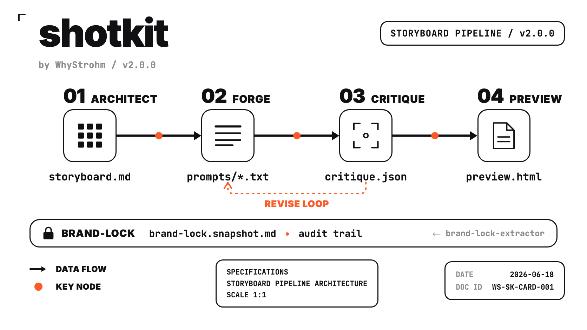
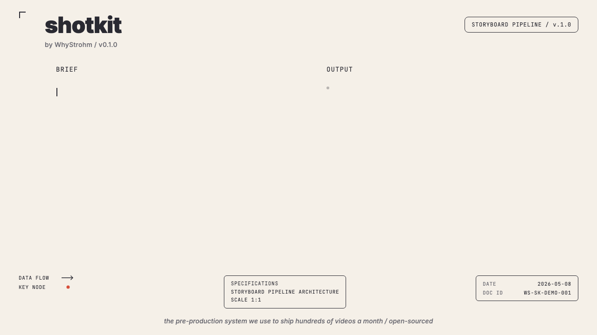

# shotkit



**The pre-production system we use to ship hundreds of videos a month. Open-sourced.**

Five Claude Skills that turn a creative brief into a production-grade storyboard with model-specific image prompts, on-screen text specs, an HTML preview, and a versioned audit trail, plus a brand-lock extractor that onboards a brand from its existing assets. Built by [WhyStrohm](https://whystrohm.com). Apache 2.0.

```bash
git clone https://github.com/whystrohm/shotkit.git
cd shotkit && ./install.sh
```

That installs all five skills into `~/.claude/skills/`. Restart your Claude Code session and they're live.



**Watch shotkit explain itself.** The 90-second explainer was made *by* shotkit. The storyboard, shots.json, brand-lock snapshot, per-generator prompts, and rendered preview live at [`skills/storyboard-architect/examples/shotkit-explainer/`](skills/storyboard-architect/examples/shotkit-explainer/). Full breakdown at [whystrohm.com/blog/you-dont-have-a-content-problem](https://whystrohm.com/blog/you-dont-have-a-content-problem).

---

## What it does

You describe a video. The kit produces a complete pre-production package:

```
output/
├── storyboard.md              # Human-readable, shot-by-shot
├── shots.json                 # Schema-validated, machine-readable
├── text-overlays.json         # On-screen text + timing
├── brand-lock.snapshot.md     # Frozen brand state at generation time
├── prompts/                   # Per-generator prompts, copy-paste ready
│   ├── midjourney.txt
│   ├── flux.txt
│   ├── ideogram.txt
│   ├── gpt-image.txt
│   ├── nano-banana.txt
│   ├── seedream.txt
│   ├── kling.txt              # Motion video (default)
│   ├── veo.txt                # Motion: dialogue/lipsync + native audio
│   ├── seedance.txt           # Motion: multi-shot sequences
│   └── hailuo.txt             # Motion: budget iteration
└── preview.html               # Single file. Shareable. Printable. Brand-aware.
```

Files. Not panels. Not a SaaS dashboard. Files an editor, agency, or developer can act on without asking follow-up questions.

---

## The five skills

| Skill | What it does |
|---|---|
| `brand-lock-extractor` | Brand assets (URL / PDF / screenshots) → validate-ready `brand-lock.md` |
| `storyboard-architect` | Brief → structured storyboard (`storyboard.md` + `shots.json`) |
| `visual-prompt-forge` | Shot data → model-specific prompts for 10 generators (6 stills, 4 motion) |
| `visual-asset-critic` | Generated image + intent → markdown critique + machine-readable `critique.json` |
| `storyboard-html-preview` | Storyboard files → single-file shareable HTML |

They work alone. They work better together, the critic writes a machine-readable verdict the prompt-forge can act on, so generate → critique → revise → re-critique runs as a closed loop. See [`docs/the-qa-loop.md`](docs/the-qa-loop.md). They work in **Claude Code**, **Claude.ai**, and the **Claude API**.

---

## Why this exists

Every storyboard tool on the market is a SaaS app with a UI you log into. You upload a brief, you get illustrated panels, you export. The output never leaves the platform.

That's not how serious teams work. Serious teams want:

- **Files**, not cloud-locked panels
- **Audit trail**, not vibes. Every shot has rationale, every prompt is reproducible, every brand parameter is versioned.
- **Brand lock**, not "AI reads your URL". Explicit brand parameters that compose deterministically across every shot.
- **Model agnosticism**. Prompts adapt to whichever image generator you're using this month.
- **No vendor lock-in**. Markdown, JSON, HTML. Open formats only.

shotkit is what we use internally at WhyStrohm to ship hundreds of videos from code. We're publishing the methodology because the methodology isn't the moat. The operator is.

Read more in [`docs/why-this-exists.md`](docs/why-this-exists.md).

---

## Why this isn't another storyboard tool

The category isn't empty. It's full of tools that solve the wrong half.

- **Brand-lock snapshots.** Every storyboard freezes brand state at run time. Six months later, you can still answer "what brand version was this approved against." None of the SaaS tools do this.
- **Ten generators, one spec.** The same shot data adapts to six stills generators (Midjourney, Flux, Ideogram, GPT Image, Nano Banana, Seedream) and four motion-video models (Kling, Veo, Seedance, Hailuo). Every other storyboard skill on GitHub locks to one generator family.
- **Files, not panels.** The output is structured Markdown and JSON an editor, motion designer, or developer can act on. No dashboard, no export step, no platform.
- **Methodology over pipeline.** The pack stops at prompts and specs. Generator APIs churn monthly, the methodology stays stable. The pipeline lives where it belongs, in the operator's tooling.

---

## 60-second example

Drop this into a Claude Code session with the skills installed:

> *"30-second founder explainer for WhyStrohm. We help founder-led brands build content infrastructure instead of running content like a hobby. Pain-reframe-promise. Use `brand-packs/whystrohm.md` as the brand lock. Aspect 9:16."*

Claude produces the full `output/` set. Open `output/preview.html` in any browser. Print it. Share it. Hand it to an editor.

A complete worked example lives at [`skills/storyboard-architect/examples/30s-pain-proof-promise/`](skills/storyboard-architect/examples/30s-pain-proof-promise/). Clone the repo and open `preview.html` in that folder to see what the deliverable looks like.

---

## Round-trip workflow

The complete loop, idea to revised image:

1. **Brief** describes the video.
2. **`storyboard-architect`** produces `storyboard.md`, `shots.json`, `text-overlays.json`, `brand-lock.snapshot.md`.
3. **`visual-prompt-forge`** writes a prompt file per generator under `output/prompts/`.
4. **`tools/copy-prompt.py`** pipes one shot's prompt to the clipboard. Paste into the generator UI.
5. **The generator** returns an image.
6. **`visual-asset-critic`** scores the image against the shot spec and brand-lock. Returns ACCEPT, REVISE, or REJECT with revision notes.
7. Revise the prompt or the shot and re-run.

Files at every step. Reproducible end-to-end.

---

## The methodology

Four ideas. None negotiable.

**1. Five-layer prompt anatomy.** Every image prompt is composed from locked layers: Brand Lock, Series Lock, Shot Spec, Text Layer, Generator Adapter. Change a brand color once. Every prompt updates. See [`docs/the-five-layer-prompt.md`](docs/the-five-layer-prompt.md).

**2. Versioned brand state.** Every storyboard run snapshots the brand-lock file it was built against. Brand changes later? You can see exactly what version this storyboard targeted. Defense-grade audit trail applied to commercial output. See [`docs/audit-trail-pattern.md`](docs/audit-trail-pattern.md).

**3. Text never gets baked into images.** On-screen copy is a separate layer with its own timing, font, and animation spec. Always composited after generation. AI text rendering is not production-ready in 2026; treat text as a separate compositing pass.

**4. Per-shot rationale.** Every shot has a `rationale` field. Why this beat. Why this duration. Why this framing. Why this on-screen text. Decisions are logged so they can be challenged.

---

## Brand packs

A brand pack is a single Markdown file that locks palette, typography, voice, and visual rules for a project. Three live in this repo:

- [`brand-packs/_template.md`](brand-packs/_template.md). Empty starter.
- [`brand-packs/whystrohm.md`](brand-packs/whystrohm.md). Flagship example, real WhyStrohm brand.
- [`brand-packs/examples/saas-clean.md`](brand-packs/examples/saas-clean.md). Neutral B2B SaaS reference.

Roll your own from the template. Or generate one from existing brand assets with [media-tsunami](https://github.com/whystrohm/media-tsunami), WhyStrohm's open-source brand voice extractor.

See [`brand-packs/README.md`](brand-packs/README.md) for the full pattern.

---

## Where this stops, where the pipeline starts

shotkit produces **specs and prompts**, not rendered images or videos. The boundary is deliberate:

- **In scope.** The methodology, the structure, the prompts, the audit trail.
- **Out of scope.** API integrations to image generators or voice tools, the video render pipeline, automated publishing.

If you want the version where this is wired into a video render pipeline with automated publishing across multiple brands: [whystrohm.com](https://whystrohm.com). The methodology is open. The operator is paid.

See [`docs/connecting-to-generators.md`](docs/connecting-to-generators.md) for how teams typically wire it up themselves, and [`docs/connecting-to-video-pipelines.md`](docs/connecting-to-video-pipelines.md) for how `shots.json` maps to programmatic video frameworks.

---

## What comes after shotkit

shotkit is one stage in a longer content infrastructure pipeline:

1. **Brief** captured from the founder
2. **shotkit** turns the brief into structured pre-production files
3. **Image generators** consume the per-generator prompt files
4. **`visual-asset-critic`** reviews each generated frame against its shot spec
5. Approved frames feed into a **programmatic video framework**
6. The framework renders the final video
7. **Publishing tools** post per-platform copy from `text-overlays.json`

shotkit owns step 2. Steps 3 through 7 are file boundaries, not API integrations. Each downstream tool reads files. Nothing is coupled beyond the schema.

For wiring it up yourself, see [`docs/connecting-to-generators.md`](docs/connecting-to-generators.md) and [`docs/connecting-to-video-pipelines.md`](docs/connecting-to-video-pipelines.md). For the operated version, [whystrohm.com](https://whystrohm.com).

---

## Companion tools

shotkit is part of a broader WhyStrohm open-source ecosystem of brand-infrastructure tools:

- [media-tsunami](https://github.com/whystrohm/media-tsunami)
  brand voice extraction. Generates the brand-pack files
  shotkit consumes.
- [whystrohm-audit](https://github.com/whystrohm/whystrohm-audit)
  content audit against a 5-layer framework.
- [whystrohm-voice-extract](https://github.com/whystrohm/whystrohm-voice-extract)
  structured voice profile from any URL.
- [whystrohm-voice-scorer](https://github.com/whystrohm/whystrohm-voice-scorer)
  voice drift between site and social content.
- [digital-twin](https://github.com/whystrohm/digital-twin-of-yourself)
  personal voice as system prompt.
- [ritual](https://github.com/whystrohm/ritual)
  Claude Code routine orchestration.

The voice tools and shotkit compose. Brand voice extracted via media-tsunami feeds shotkit's brand-pack files for end-to-end brand consistency.

For the operated version of the full pipeline, see [whystrohm.com](https://whystrohm.com).

---

## Compatibility

- **Claude.ai** (web, mobile, desktop). All five skills via `.skill` zip uploads. See [`docs/claude-ai-workflow.md`](docs/claude-ai-workflow.md).
- **Claude Code** (CLI). Primary target. Drop the repo and run `./install.sh`. See [`docs/claude-code-workflow.md`](docs/claude-code-workflow.md).
- **Claude API**. All five skills via Skills API.
- **Other agents** that support the SKILL.md open standard (Codex, Cursor, Gemini CLI, Antigravity, Windsurf) should work, not officially tested.

Tested against Claude Opus 4.7 and Claude Sonnet 4.6.

---

## Roadmap

v2.0.0 (unreleased) closes the QA loop: structured `critique.json` output, a guarded capability matrix, prompt-forge revision mode, and the fal.ai motion lineup (Kling / Veo / Seedance / Hailuo). See the [changelog](CHANGELOG.md). Still on the roadmap:

- **`brand-lock-extractor`**. Upload a brand book (PDF, screenshots, URL), get a `brand-lock.md` back. The cold-start killer.
- **PDF + PPTX exporters**. Siblings to `storyboard-html-preview` for client review and agency handoff.
- **User-supplied asset folder**. The `shot.assets` field landed in shots schema v1.1; wiring the HTML preview and critic to consume it is the remaining work.
- **Duration rescale workflow**. Change a project from :30 to :60 and have the timing redistribute correctly across the beat framework.

If any of these are blocking for you, open an issue. Real use cases jump the queue.

---

## Contributing

PRs welcome for:

- New generator adapters (`skills/visual-prompt-forge/adapters/`)
- New beat frameworks (`skills/storyboard-architect/references/beat-frameworks.md`)
- Brand pack examples (`brand-packs/examples/`)

Open an issue first for anything that changes the file schemas. Run validators locally before opening a PR:

```bash
pip install pyyaml jsonschema
python tools/validate_skills.py
python tools/validate_schemas.py
python tools/validate_brand_lock.py brand-packs/_template.md
python tools/validate_capabilities.py
python tools/validate_critique.py --selftest
```

CI runs all of these on every PR.

---

## License

Apache 2.0. See [LICENSE](LICENSE).

---

## Who built this

[Yuri Strohm](https://whystrohm.com). Motion Design and Narrative Visualization Specialist, founder of WhyStrohm. A decade of defense-adjacent design work informs how I build content systems: deterministic, auditable, no surprises.

If you want the version where this is wired into a programmatic video pipeline with automated publishing: [whystrohm.com](https://whystrohm.com).

- GitHub: [@whystrohm](https://github.com/whystrohm)
- Web: [whystrohm.com](https://whystrohm.com)
